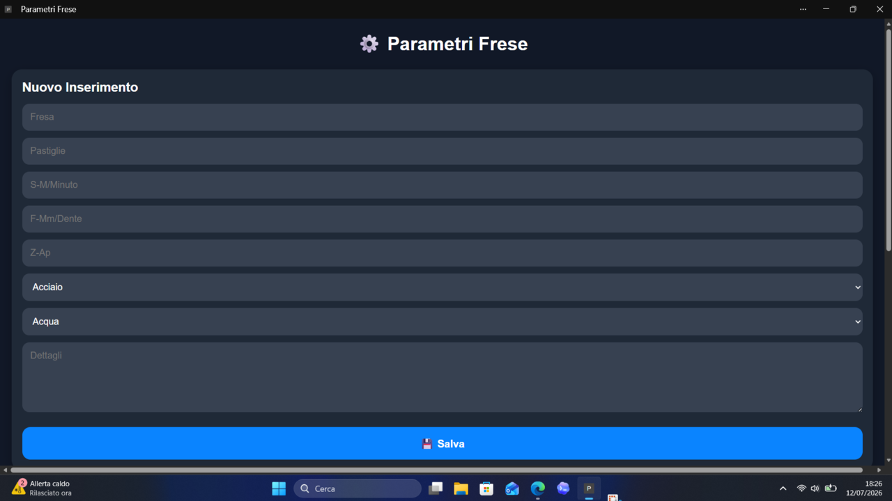

# ⚙️ Parametri Frese  
Archivio digitale dei parametri di taglio per frese CNC, con calcolo automatico di S e F, archivio consultabile, modifica tramite popup e esportazione CSV compatibile con Apple Numbers ed Excel.



---

## 📌 Funzionalità principali

### 🔢 Calcolo automatico parametri
- **S calcolata** = (1000 × M/min) / (3.14 × Diametro)  
- **F calcolata** = Av.Ad × N.Taglienti × S calcolata  
- Aggiornamento in tempo reale mentre l’utente digita.

### 📚 Archivio frese
- Salvataggio locale tramite **LocalStorage**
- Ricerca istantanea
- Pulsanti **Modifica** e **Elimina**
- Popup di modifica con ricalcolo automatico dei parametri

### 📄 Esportazione CSV
- Esporta l’intero archivio in formato CSV
- Compatibile con:
  - Apple Numbers
  - Microsoft Excel
  - Google Sheets

### 📱 PWA – App installabile
- Installabile su:
  - iPhone / iPad
  - Android
  - Desktop (Chrome / Edge)
- Funziona offline grazie al **Service Worker**
- Icone e screenshot ottimizzati

---

## 🧩 Struttura del progetto


---

## 🚀 Installazione (GitHub Pages)

1. Carica tutti i file nel repository.
2. Vai su **Settings → Pages**.
3. Imposta:
   - **Source:** `main`
   - **Folder:** `/root`
4. L’app sarà disponibile su:


---

## 🔧 Tecnologie utilizzate

- **HTML5**
- **CSS3 (mobile-first)**
- **JavaScript Vanilla**
- **LocalStorage**
- **Service Worker**
- **PWA Manifest**

---

## 🛠️ Sviluppo

### Modifica dei parametri
Tutti i calcoli sono centralizzati in `app.js`:

```js
const sCalc = (1000 * mmin) / (3.14 * diametro);
const fCalc = avAd * ntaglienti * sCalc;

Denominazione Fresa;
Diametro;
N.Taglienti/Inserti;
S;
M/Minuto;
S calcolata;
F;
Av.Ad;
F calcolata;
Z-Ap;
Materiale;
Refrigerante;
Codice fresa;
Codice inserto;
Dettagli


